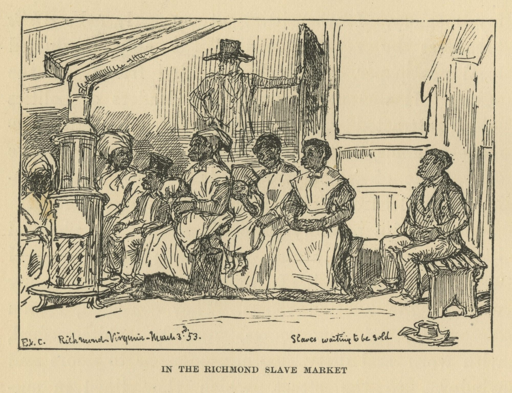
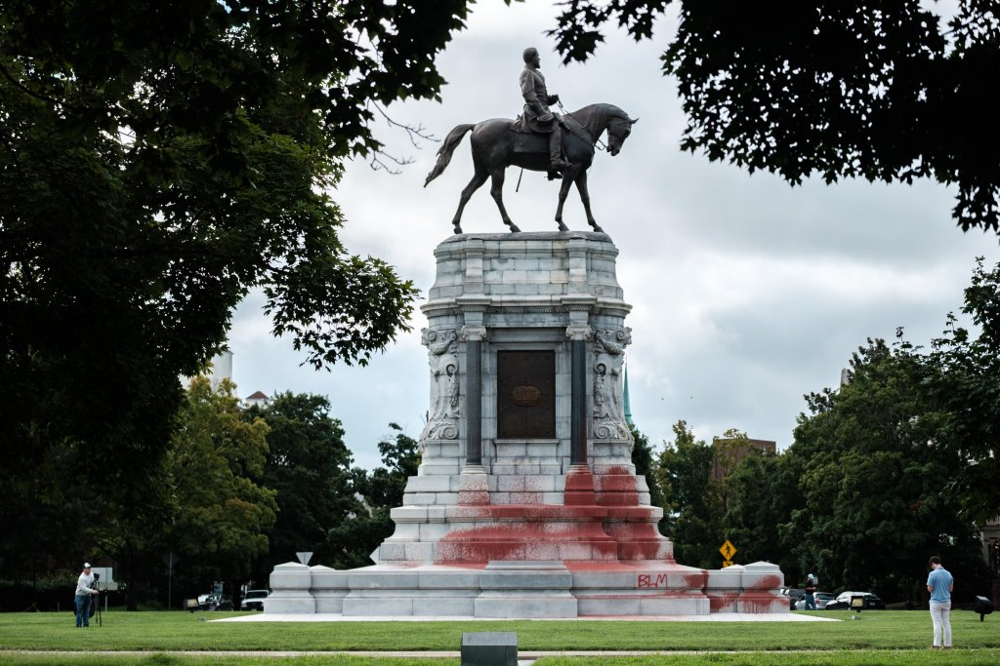
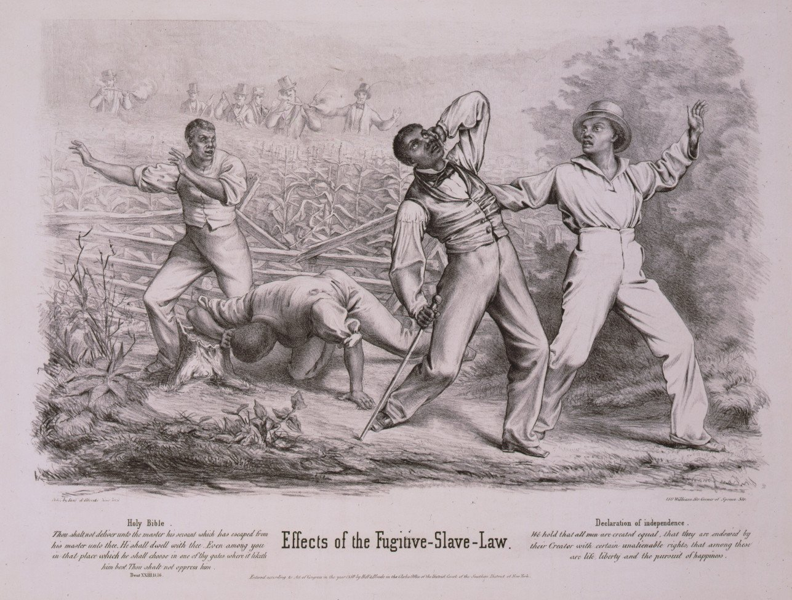

## Myths, misconceptions and misunderstandings about race, slavery and the Civil War 

**“In the Richmond Slave Market” by Eyre Crowe, an English artist who visited Richmond in 1853. (Library of Virginia)**

* Slaves were treated well.

* Blacks fought in large numbers for the Confederacy.

* The Civil War was about states’ rights.

These are myths, spread to dress up the horrors of slavery and justify Confederates, historians say. Many have racist origins. Historians and others say we can never achieve racial peace in America unless we acknowledge the brutality of slavery and its continuing legacy of racial discrimination.

>  “Myths about slavery prevent any type of reconciliation or dialogue,” said **Adam W. Dean,** a University of Lynchburg historian. 
>
> “If you are a white person and you say slaves were treated well but I’m not a racist, that’s just a non-starter for most African-Americans.”

Slavery myths are gaining a foothold with a new generation that consumes misinformation on the internet but never learned to weigh evidence, said **Kevin M. Levin**, a Boston historian and University of Richmond graduate. 

>  “It’s not malicious intent” with many new believers, Levin said. “It’s ignorance. These are the same people who believe we didn’t go to the moon because they came across a website that’s persuasive.”

As Virginia commemorates the 400th anniversary of the arrival of African slaves on our shores, it’s a good time to set the record straight. 

Here are some key myths, misconceptions and misunderstandings about slavery in Virginia and the U.S:

#### You can’t apply today’s moral standards to long-ago supporters of slavery.

**Red paint covers the base of a statue of Confederate Gen. Robert E. Lee on Richmond’s Monument Avenue. (Ned Oliver/Virginia Mercury – Aug. 4, 2018)**

Confederate Gen. Robert E. Lee, a hero to many, was a white supremacist.

He publicly denied that the African-American was “as capable of acquiring knowledge as the white man is.” Asked by a congressional committee what future he desired for former slaves, Lee replied, “I think it would be better for Virginia if she could get rid of them.”

Red paint covers the base of a statue of Confederate Gen. Robert E. Lee on Richmond’s Monument Avenue. (Ned Oliver/Virginia Mercury – Aug. 4, 2018)
But racism and white supremacy were widespread in the 1800s, and modern defenders of Lee and the Confederacy say it’s unfair to judge people of that era by modern values.

Except that even then, and long before, many people thought slavery was wrong.

“Frankly, people of the period acknowledged what a moral evil this was,” Coleman said. “They may not have been a majority, but there were people who acknowledged this wasn’t right.”

Patrick Henry, a founding father from Virginia, expressed his “abhorrence” at owning slaves but admitted he was “drawn along by the general inconvenience of living here without them.” Henry did not free his slaves, but he addressed slavery in other ways, including working with others to end the importation of slaves into the U.S., beginning in 1808.

Richard Randolph, from a wealthy Virginia planter family, inherited slaves unwillingly. When he died at 26 in 1796, Randolph left a will that freed those slaves and granted them land on the principle that all people are equal. In the will, Randolph said he did “humbly beg” his slaves’ forgiveness for holding them in bondage.

Two other contemporary Virginians, George Washington and Robert Carter, also left wills freeing their slaves and providing assistance for their transition to freedom.

George Wythe, a Virginian who signed the Declaration of Independence, not only opposed slavery but declared his belief in the innate equality of the races.

“These men were products of their times, too, and they didn’t have any trouble discerning that slavery contradicted the founding principles of the United States,” said W&M’s Ely, who focuses on African-Americans and the South.

#### Slaves were happy.

This myth comes “as is” and with variations. 

In the past year alone, I’ve heard Virginians say “Slavery couldn’t have been bad everywhere.” And, “slaves couldn’t have minded too much since that was all they knew.” And, multiple times: “I always heard the slaves in my family were treated well.”

Slave owners told themselves and the world that slaves were content — even as slaves escaped and masters feared uprisings.

“I think there was some self-deception at work,” Dean said.

The truth became clear when thousands of slaves escaped to Union lines during the war.

During the war and Reconstruction — the postwar period in which African-Americans won some civil rights — owners were forced to recognize that enslaved people wanted freedom. Amazingly, many former owners blamed the slaves — for disloyalty.

“There was an overwhelming sense of anger and betrayal among the white owners,” Lynchburg’s Dean said. “And that explains why there was so much violence during Reconstruction and the formation of the Ku Klux Klan and these white paramilitary groups.”

It’s hard to process just how brutal slavery was. Enslaved people did back-breaking work and endured painful punishments. Many enslaved women were preyed upon sexually — especially in the “big house,” where even Northerners mistakenly thought slaves had it better. In the 1830s, slave traders began openly marketing sex slaves. Sometimes called “fancy girls” or “maids,” the women were often of mixed race, light-skinned and highly desired.

Generally, slaves couldn’t own anything of substance, learn to read, come and go freely or legally marry. And at any time a loved one could be “sold down the river” — be it the Mississippi or the James. (Virginia was a huge seller of “surplus” slaves in the 1800s, many of them shipped out of Richmond.)

“Slavery was the selling of your children,” Dean said. “There was always the threat of that.”

Treatment of the enslaved varied greatly by era, place and master. Some masters tried to avoid breaking up families. Some bought Christmas presents for their slaves. A very few took enslaved women as de facto wives and sent their children to schools. But experts say all masters — **from the grotesquely sadistic to those with a lighter hand — ultimately ruled by violence, or the threat of it**.

In addition to being switched or whipped, some slaves were shackled, water-boarded, branded, locked up or mutilated. 

(**Colonial Virginia planter Robert “King” Carter — grandfather of the Robert Carter who freed his slaves — chopped off the toes of runaways**) The man who had his slaves beaten less often than his neighbor, or who provided slightly more food, could gain a reputation as a good master.

It simply was not possible for slaves to be treated well anywhere, Dean said. “I think any situation where you put human beings into a position of power over another human being leads to mistreatment.”

#### Thousands of black soldiers fought for the Confederacy.

This myth apparently was spun in the 1970s by aficionados of the Confederacy, said Levin, the Boston historian. During the ’70s, it was becoming increasingly clear to the public that the Confederacy indeed fought to protect slavery.

> “If you are constantly being reminded that the Confederacy fought for slavery, that it fought to actually maintain white supremacy, then your response to that is, ‘How can Confederates be fighting to preserve slavery if black men fought as soldiers alongside white men in the army?’ So it’s a way of neutralizing that growing challenge,” Levin said.

Levin is the author of the soon-to-be-published book, “Searching for Black Confederates: The Civil War’s Most Persistent Myth.”

Many enslaved people were forced to aid the Confederacy by digging trenches, driving wagons or helping build cannons at the Tredegar Iron Works in Richmond, Levin said. (The Confederacy drafted many free blacks to do the same kind of work.) Some Confederate soldiers brought slaves with them as “body servants.”

But there are no records showing that Confederate officials considered these men soldiers, Levin said. In fact, Confederate law prohibited slaves from being soldiers for nearly the entire war.

In late 1864, a few months before the war’s end, Confederate officials began debating whether to use slaves as soldiers. Robert E. Lee was among those favoring the shift.

On the other hand, prominent Georgian Howell Cobb wrote: “If slaves will make good soldiers our whole theory of slavery is wrong.”

A few weeks before the end of the war, the Confederate Congress voted to allow slaves to become soldiers. There are records of several dozen black Confederates marching around Richmond but no evidence they fought, Levin said.

The Encyclopedia Virginia, part of the Virginia Humanities in partnership with the Library of Virginia, says: “Only a few black men were ever accepted into Confederate service as soldiers, and none did any significant fighting.”

#### Robert E. Lee opposed slavery.

“That’s nonsense,” said Levin. “That’s an easy one.” The myth of Lee’s opposition to slavery re-surfaced in the Virginia Senate in January when Sen. Richard H. Stuart, a Stafford County Republican, praised Lee as a slavery opponent and “a great Virginian and a great American.”

The anti-slavery myth is based on an 1856 letter Lee sent to his wife in which he said “slavery as an institution is a moral and political evil.” Few Lee supporters note that Lee went on to say slavery was a greater evil for whites than for blacks.

Lee said in the letter, “The blacks are immeasurably better off here than in Africa, morally, socially & physically. The painful discipline they are undergoing, is necessary for their instruction as a race, & I hope will prepare & lead them to better things.”

He also left emancipation to “a wise & merciful Providence” and said it would be achieved sooner “from the mild & melting influence of Christianity, than the storms & tempests of fiery Controversy.”

Lee “disliked the institution (of slavery) — more for its inefficiency than from moral repugnance — yet defended it throughout his life,” according to an Encyclopedia Virginia entry by the late Lee biographer Elizabeth Brown Pryor.

While overseeing slaves at Arlington, his wife’s family seat, Lee could be brutal, according to slave accounts.

“Lee had no problem selling off and separating enslaved families, as his needs required,” Coleman said.

#### The Civil War was not about slavery but states’ rights. 

**An 1850 lithograph about the Fugitive Slave Act from Hoff and Bloede, publishers. (Encyclopedia Virginia, courtesy of Library of Congress)**

After the war, Southerners often maintained that they had fought not to preserve slavery but to protect the rights of states oppressed by the federal government. But when Deep South states seceded and sought to get upper-South states like Virginia to join them, they made the rebels’ intentions clear.

“The Confederate leadership in 1861 loudly proclaimed that they were leaving the Union and forming the Confederacy to preserve slavery and white supremacy,” said Ely, a winner of the prestigious Bancroft Prize in history.

 An 1850 lithograph about the Fugitive Slave Act from Hoff and Bloede, publishers. (Encyclopedia Virginia, courtesy of Library of Congress)
“Yes, the Confederacy fought for states’ rights — but states’ rights to do what? The Confederate vice president famously declared that the ‘corner-stone‘ of the Confederacy rested ‘upon the great truth that the negro is not equal to the white man; that slavery — subordination to the superior race — is his natural and normal condition.’ “

Here is another example of the states’-rights myth: In the years before the war, some northern states provided safe harbor for runaway slaves. The South got a federal law passed in 1850 that required northerners to return runaways.

“That was a total violation of states’ rights — of northern states’ rights,” Ely said.

“The white South on the whole in the 80 years before the Civil War was for states’ rights when that would preserve slavery, and they were for federal intervention when that would preserve slavery,” Ely said.

Historians have agreed for decades that slavery was the main cause of the Civil War.

More evidence: Regions of the South with fewer slaves — including East Tennessee, western North Carolina and western Virginia, which became West Virginia — did not support the Confederacy, Dean said.

#### Most Confederate soldiers didn’t own slaves. 
This is true but misleading — an apparent attempt by some to justify their ancestors’ actions.

Slaves were expensive — a strong field hand could bring $1,800 in 1860, or about $55,000 today — and most men who became Confederate soldiers couldn’t afford them. But support for slavery was widespread in the South, even among non-owners. Slave ownership was a sign of status — slave holders had the nicest homes, horses, etc., — and many soldiers aspired to own slaves one day.

“Non-slave holders didn’t hate the slaveholders,” Dean said. “They wanted to be them.”

Some soldiers fought to defend slavery. Some fought because, like most able-bodied young men in the South, the Confederacy drafted them. Many soldiers felt like they were defending their homeland from invasion.

“And many were unwilling to live alongside the four million African Americans who might go free if the Confederacy lost,” Ely said.

#### Owners wouldn’t hurt enslaved people because slaves were valuable property.

The point of slavery was to make money, so masters normally didn’t want to injure slaves so badly they couldn’t work, W&M’s Ely said. Enslaved people were sometimes put under the whip, but that whip could cut skin, break bones and even kill. More often, switches, paddles and other instruments — painful but less damaging — were used, Ely said.

“No one but a sadist or a person acting in a fit of rage would render their own property unprofitable, but they hurt them often. Looking at masters’ own records quickly refutes any assertion of how benign slavery was.”

Dean said, “Because slaves are not just property but human beings, they don’t want to be slaves …Because they are not being paid to work, there is really no incentive” but violence and the threat of sale to control slaves.

Enslaved people resisted their masters by working slowly, stealing things and starting fires, among other measures. This gave rise to racist stereotypes  that long outlasted slavery, Ely said.

#### Yankees were just as racist as Southerners, if not more so. 

**The woodcut image of a slave in chains appeared on the 1837 broadside publication of John Greenleaf Whittier’s antislavery poem, “Our Countrymen in Chains.” The design, which became a prominent image for American abolitionists, was originally adopted as the seal of the Society for the Abolition of Slavery in England in the 1780s (Library of Congress)**

.jpg)

Many whites in the North and South held racist views in pre-Civil War America — that blacks were less than human, less intelligent and crime-prone.

That white racism prevailed despite evidence refuting racial stereotypes, Coleman said. 

For example, many Europeans knew from explorations that sophisticated civilizations existed in sub-Saharan Africa long before blacks were enslaved and sent to the New World.

As slavery took hold, Coleman said, “You have to begin to justify one’s inhumanity towards another.

“The best way to do that is to make them less human … And that’s exactly what happened. And we live with the vestiges of that in contemporary society.”

Still, the northern states voted by the early 1800s to end slavery, though in some places that process was gradual.

And in the North, abolitionists, clergymen and others condemned slavery.

#### Those 1619 Africans were indentured servants. 

Historians say the Africans were enslaved, but the servant story lives on. 

Gov. Ralph Northam drew criticism when he repeated it in February.

According to the latest research, Portuguese slavers captured the Africans. Two English privateers  — pirates with government sanction — stole 50 or so of the slaves at sea. One of those vessels, the White Lion, sold the 20 or so Africans at Point Comfort, now part of Hampton. The Africans were sold again in Jamestown.

Coleman said the Africans remained enslaved in Virginia.

Dean said the fate of the slaves in Virginia “is not at all clear” but that experts “are trying really hard to find out.”

Melvin Patrick Ely, a College of William & Mary historian, said, “Over the years, the myth of indentured servants has comforted both those who want to diminish Virginia’s responsibility for slavery and some who understandably want to see Africans playing a role in history other than that of slaves.”

Indentured and enslaved people alike endured brutal, sometimes deadly, work. But indentured servants could see freedom in the future, usually after seven years of labor. Unlike slaves, servants’ families weren’t split up, and their children weren’t born into lifelong bondage.
