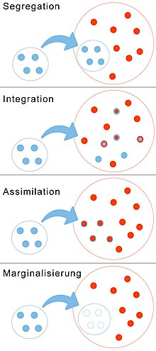

## Acculturation

**Acculturation** is a process of social, psychological, and cultural change that stems from the balancing of two cultures while adapting to the prevailing culture of the society. 

Acculturation is a process in which an individual adopts, acquires and adjusts to a new cultural environment as a result of being placed into a new culture, or when another culture is brought to someone. 

Individuals of a differing culture try to incorporate themselves into the new more prevalent culture by participating in aspects of the more prevalent culture, such as their traditions, but still hold onto their original cultural values and traditions. The effects of acculturation can be seen at multiple levels in both the devotee of the prevailing culture and those who are assimilating into the culture.

At this group level, acculturation often results in changes to culture, religious practices, health care, and other social institutions. There are also significant ramifications on the food, clothing, and language of those becoming introduced to the overarching culture.

At the individual level, the process of acculturation refers to the socialization process by which foreign-born individuals blend the values, customs, norms, cultural attitudes, and behaviors of the overarching host culture. 

This process has been linked to changes in daily behaviour, as well as numerous changes in psychological and physical well-being. 

As **enculturation** is used to describe the process of first-culture learning, acculturation can be thought of as second-culture learning.

Under normal circumstances that are seen commonly in today's society, the process of acculturation normally occurs over a large span of time throughout a few generations. Physical force can be seen in some instances of acculturation, which can cause it to occur more rapidly, but it is not a main component of the process. More commonly, the process occurs through social pressure or constant exposure to the more prevalent host culture.

Scholars in different disciplines have developed more than 100 different theories of acculturation, but the concept of acculturation has only been studied scientifically since **1918**.

As it has been approached at different times from the fields of psychology, anthropology, and sociology, numerous theories and definitions have emerged to describe elements of the acculturative process. Despite definitions and evidence that acculturation entails a two-way process of change, research and theory have primarily focused on the adjustments and adaptations made by minorities such as immigrants, refugees, and indigenous people in response to their contact with the dominant majority. Contemporary research has primarily focused on different strategies of acculturation, how variations in acculturation affect individuals, and interventions to make this process easier.

